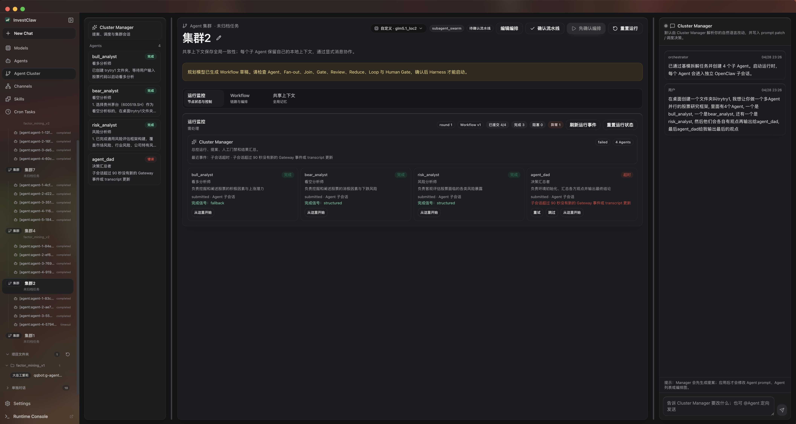
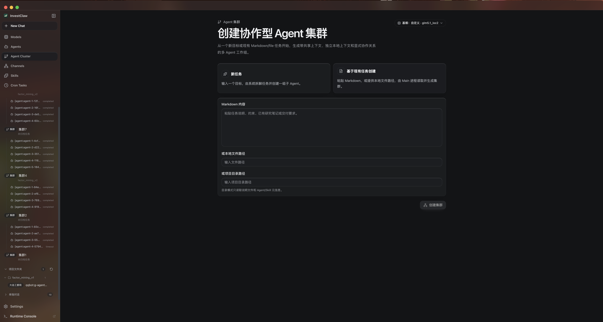
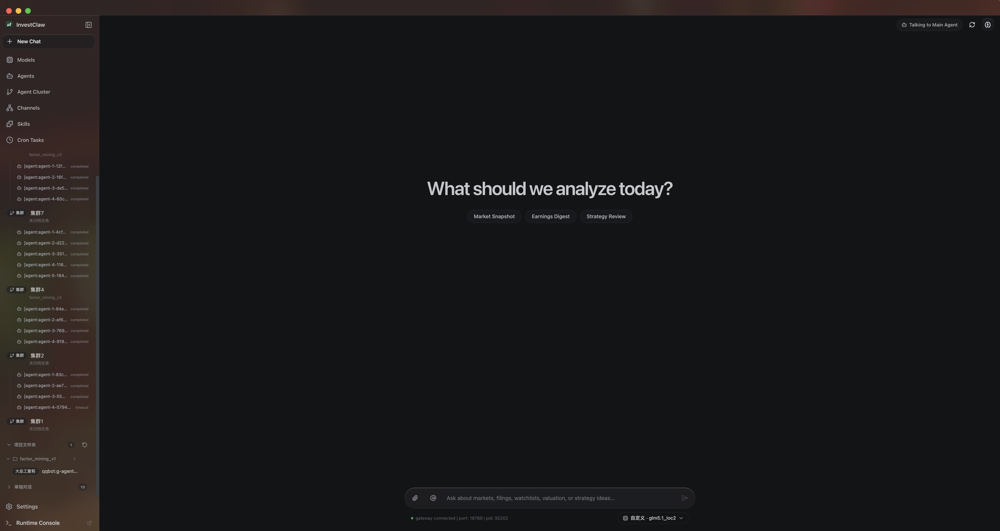
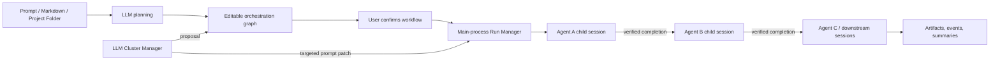

<p align="center">
  
</p>

<h1 align="center">InvestClaw</h1>

<p align="center">
  <strong>Local-first multi-agent investment research desktop</strong>
</p>

<p align="center">
  <a href="#agent-clusters">Agent Clusters</a> •
  <a href="#features">Features</a> •
  <a href="#why-investclaw">Why InvestClaw</a> •
  <a href="#getting-started">Getting Started</a> •
  <a href="#architecture">Architecture</a> •
  <a href="#development">Development</a> •
  <a href="#contributing">Contributing</a>
</p>

<p align="center">
  
  
  
  
  
</p>

<p align="center">
  English | <a href="README.zh-CN.md">简体中文</a>
</p>

---

## Overview

**InvestClaw** is a desktop workspace for investors who want a dedicated research desk without command-line overhead. It turns multi-step market research, filings review, watchlist maintenance, and idea generation into a guided GUI workflow.

Whether you're running a morning market brief, dissecting an earnings release, or automating recurring portfolio checklists, InvestClaw gives you one place to organize those flows.

InvestClaw ships with embedded runtime services, multi-provider setup, document skills, and desktop-native controls. You can still fine-tune advanced behavior via **Settings → Advanced → Developer Mode**.

This repository is an Agent Cluster-focused community edition maintained by [EthanCai330](https://github.com/EthanCai330). It is based on the upstream [Arain-sh/InvestClaw](https://github.com/Arain-sh/InvestClaw) project and preserves its MIT license and contributor history.

> InvestClaw is a research assistant. It does not provide financial advice, and you should validate any investment decision independently.

---
## Screenshot

<p align="center">
  <strong>Agent Cluster workspace</strong><br>
  
</p>

<p align="center">
  <strong>Create from a task, Markdown, file, or project folder</strong><br>
  
</p>

<p align="center">
  <strong>Standalone chat</strong><br>
  
</p>

---

## Why InvestClaw

Investment research should feel like a repeatable workflow, not a pile of tabs and scratch notes. InvestClaw is designed to make agent-driven analysis structured, inspectable, and easy to run every day.

| Challenge | InvestClaw Solution |
|-----------|----------------|
| Research scattered across tools | One desktop workspace for chat, files, agents, and recurring tasks |
| Filings and earnings overload | Built-in document skills for PDFs, spreadsheets, and transcripts |
| Repeating the same daily checks | Cron automation for routine market and portfolio workflows |
| Switching models/providers manually | Unified provider configuration with fallback support |
| Hard-to-audit AI workflows | Session history, explicit agent routing, and runtime visibility |

### Embedded Runtime

InvestClaw bundles its runtime inside the desktop application, so installation, upgrades, and daily use stay inside one product workflow.

The result is a smoother setup path for research work: fewer moving parts, fewer manual steps, and a more consistent desktop experience.

---

## Features

### 🎯 Zero Configuration Barrier
Complete the entire setup—from installation to your first AI interaction—through an intuitive graphical interface. No terminal commands, no YAML files, no environment variable hunting.

### 💬 Intelligent Chat Interface
Communicate with AI agents through a modern chat experience. Support for multiple conversation contexts, message history, rich content rendering with Markdown, and direct `@agent` routing in the main composer for multi-agent setups.
When you target another agent with `@agent`, InvestClaw switches into that agent's own conversation context directly instead of relaying through the default agent. Agent workspaces stay separate by default, and stronger isolation depends on runtime sandbox settings.
Each agent can also override its own `provider/model` runtime setting; agents without overrides continue inheriting the global default model.
The sidebar organizes history into Agent Clusters, project folders, and standalone chats. Standalone chats can be dragged into a project folder for local UI organization without moving the underlying OpenClaw transcript files.

## Agent Clusters

Agent Clusters turn a research brief or an existing project into an inspectable multi-agent workflow. The renderer never calls OpenClaw directly: creation, filesystem access, persistence, scheduling, and runtime recovery all stay behind the Host API and Electron main process.

### Create from the context you already have

- **New task:** describe a goal and let the selected AI Provider propose agents, responsibilities, shared context, and a workflow.
- **Markdown or file:** import an existing specification without moving the source file.
- **Project folder:** read `README.md` and `HANDOFF.md`, then follow an optional `InvestClaw Directory Manifest` to load declared agent prompts, tools, skills, and context files.
- **Authoritative prompts:** when the project declares agent prompt files, InvestClaw preserves those definitions and uses the planning model mainly for shared context and orchestration.

Example directory manifest:

```yaml
agent_prompts:
  - agents/data_steward.md
  - agents/factor_generator.md
agent_tools:
  - agents/tools/prepare_data.py
skills:
  - skills/research/SKILL.md
context:
  - core/domain_rules.md
```

Manifest paths must remain inside the selected project root. Absolute paths, parent-directory traversal, and symlink escapes are rejected.

### Confirm the workflow before it runs

The planning model produces a suggested graph rather than immediately launching every agent. You can move nodes, add or remove edges, change edge types, and configure loop segments before confirming the workflow.

| Edge type | Runtime behavior |
|-----------|------------------|
| `blocks` | The downstream agent waits for verified upstream completion |
| `reviews` | The reviewer must finish before the reviewed path continues |
| `informs` | Passes context without blocking execution |
| `reports_to` | Documents reporting flow without imposing order |
| `writes_to_memory` | Marks a memory handoff without creating a DAG dependency |

Blocking edges must form a valid DAG. Explicit loop components model repeated subchains without introducing an invalid blocking cycle.

### Real child sessions with reliable scheduling



- Every business agent runs in a separate OpenClaw child session with its own local context.
- Shared context contains summaries, decisions, constraints, and artifacts rather than every private message.
- The Run Manager verifies structured completion signals and expected artifacts before unblocking downstream nodes.
- Gateway events and transcript reconciliation update the graph automatically; refresh, retry, skip, stop, reset, and resume-from-agent controls remain available.
- The LLM Cluster Manager converts natural-language changes into a reviewable proposal. Prompt patches, new agents, and graph edits are applied only after confirmation.

### Cluster workspace

The cluster detail view uses three resizable areas: agent status, orchestration graph, and conversation/event stream. The sidebar separates **Agent Clusters**, **project folders**, and **standalone chats**. Standalone chats can be dragged into project folders without moving OpenClaw transcript files.

Agent Cluster planning requires an enabled AI Provider configured in **Settings → AI Providers**. No private model endpoint is bundled or contacted by default.

## More Features

### 📡 Multi-Channel Management
Configure and monitor multiple AI channels simultaneously. Each channel operates independently, allowing you to run specialized agents for different tasks.
Each channel now supports multiple accounts, per-account agent binding, and switching the channel default account directly from the Channels page.
InvestClaw now also includes a personal WeChat channel bridge, so you can link WeChat directly from the Channels page with an in-app QR flow.

### ⏰ Cron-Based Automation
Schedule AI tasks to run automatically. Define triggers, set intervals, and let your AI agents work around the clock without manual intervention.
The Cron page now lets you configure external delivery directly in the task form with separate sender-account and recipient-target selectors. For supported channels, recipient targets are discovered automatically from channel directories or known session history, so you no longer need to edit `jobs.json` by hand.
Known limitation: WeChat is intentionally excluded from supported cron delivery channels for now. The current `openclaw-weixin` plugin requires a live conversation `contextToken` for outbound sends, so cron-style proactive delivery is not supported by the plugin itself.

### 🧩 Extensible Skill System
Extend your AI agents with pre-built skills. Browse, install, and manage skills through the integrated skill panel—no package managers required.
InvestClaw also pre-bundles full document-processing skills (`pdf`, `xlsx`, `docx`, `pptx`), deploys them automatically to the managed skills directory (default `~/.openclaw/skills`) on startup, and enables them by default on first install. Additional bundled skills (`find-skills`, `self-improving-agent`, `tavily-search`, `brave-web-search`) are also enabled by default; if required API keys are missing, the runtime will surface configuration errors.  
The Skills page can display skills discovered from multiple runtime sources (managed dir, workspace, and extra skill dirs), and now shows each skill's actual location so you can open the real folder directly.

Environment variables for bundled search skills:
- `BRAVE_SEARCH_API_KEY` for `brave-web-search`
- `TAVILY_API_KEY` for `tavily-search` (OAuth may also be supported by upstream skill runtime)
- `find-skills` and `self-improving-agent` do not require API keys

### 🔐 Secure Provider Integration
Connect to multiple AI providers (OpenAI, Anthropic, and more) with credentials stored securely in your system's native keychain. OpenAI supports both API key and browser OAuth (Codex subscription) sign-in.
For **Custom** providers used with OpenAI-compatible gateways, you can set a custom `User-Agent` in **Settings → AI Providers → Edit Provider** for compatibility-sensitive endpoints.

### 🌙 Adaptive Theming
Light mode, dark mode, or system-synchronized themes. InvestClaw adapts to your preferences automatically.

### 🚀 Startup Launch Control
In **Settings → General**, you can enable **Launch at system startup** so InvestClaw starts automatically after login.

---

## Getting Started

### System Requirements

- **Operating System**: macOS 11+, Windows 10+, or Linux (Ubuntu 20.04+)
- **Memory**: 4GB RAM minimum (8GB recommended)
- **Storage**: 1GB available disk space

### Installation

#### Pre-built Releases (Recommended)

Download the latest release for your platform from the [Releases](https://github.com/EthanCai330/Agent_TEAM_investclaw/releases) page.

#### Build from Source

```bash
# Clone the repository
git clone https://github.com/EthanCai330/Agent_TEAM_investclaw.git
cd InvestClaw

# Initialize the project
pnpm run init

# Start in development mode
pnpm dev
```

#### Run the Desktop App Locally

If you want to use the full desktop app locally without relying on the Vite development server, build the app assets and launch the Electron entry directly:

```bash
pnpm run start:local
```

This path matches the built desktop flow used by automated Electron smoke tests and is the most reliable local launch mode when `pnpm dev` is only needed for renderer development.
### First Launch

When you launch InvestClaw for the first time, the **Setup Wizard** will guide you through:

1. **Language & Region** – Configure your preferred locale
2. **AI Provider** – Add providers with API keys or OAuth (for providers that support browser/device login)
3. **Skill Bundles** – Select pre-configured skills for common use cases
4. **Verification** – Test your configuration before entering the main interface

The wizard preselects your system language when it is supported, and falls back to English otherwise.

> Note for Moonshot (Kimi): InvestClaw keeps Kimi web search enabled by default.  
> When Moonshot is configured, InvestClaw also syncs Kimi web search to the China endpoint (`https://api.moonshot.cn/v1`) in runtime config.
>
> `Kimi Code` is available as a separate built-in provider. It uses the coding endpoint (`https://api.kimi.com/coding`) and the `anthropic-messages` protocol, while `Moonshot (CN)` keeps using the standard China endpoint.

### Proxy Settings

InvestClaw includes built-in proxy settings for environments where Electron, the InvestClaw gateway, or channels such as Telegram need to reach the internet through a local proxy client.

Open **Settings → Gateway → Proxy** and configure:

- **Proxy Server**: the default proxy for all requests
- **Bypass Rules**: hosts that should connect directly, separated by semicolons, commas, or new lines
- In **Developer Mode**, you can optionally override:
  - **HTTP Proxy**
  - **HTTPS Proxy**
  - **ALL_PROXY / SOCKS**

Recommended local examples:

```text
Proxy Server: http://127.0.0.1:7890
```
Notes:

- A bare `host:port` value is treated as HTTP.
- If advanced proxy fields are left empty, InvestClaw falls back to `Proxy Server`.
- Saving proxy settings reapplies Electron networking immediately and restarts the Gateway automatically.
- InvestClaw also syncs the proxy to the runtime's Telegram channel config when Telegram is enabled.
- Gateway restarts preserve an existing Telegram channel proxy if InvestClaw proxy is currently disabled.
- To explicitly clear Telegram channel proxy from runtime config, save proxy settings with proxy disabled.
- In **Settings → Advanced → Developer**, you can run **Runtime Diagnostics** to execute `openclaw doctor --json` and inspect the diagnostic output without leaving the app.
- On packaged Windows builds, the bundled `openclaw` CLI/TUI runs via the shipped `node.exe` entrypoint to keep terminal input behavior stable.

---

## Architecture

InvestClaw employs a **dual-process architecture** with a unified host API layer. The renderer talks to a single client abstraction, while Electron Main owns protocol selection and process lifecycle:

```┌─────────────────────────────────────────────────────────────────┐
│                        InvestClaw Desktop App                         │
│                                                                  │
│  ┌────────────────────────────────────────────────────────────┐  │
│  │              Electron Main Process                          │  │
│  │  • Window & application lifecycle management               │  │
│  │  • Gateway process supervision                              │  │
│  │  • Agent Cluster persistence, DAG scheduling & recovery      │  │
│  │  • System integration (tray, notifications, keychain)       │  │
│  │  • Auto-update orchestration                                │  │
│  └────────────────────────────────────────────────────────────┘  │
│                              │                                    │
│                              │ IPC (authoritative control plane)  │
│                              ▼                                    │
│  ┌────────────────────────────────────────────────────────────┐  │
│  │              React Renderer Process                         │  │
│  │  • Modern component-based UI (React 19)                     │  │
│  │  • State management with Zustand                            │  │
│  │  • Resizable Agent Cluster graph and event workspace         │  │
│  │  • Unified host-api/api-client calls                        │  │
│  │  • Rich Markdown rendering                                  │  │
│  └────────────────────────────────────────────────────────────┘  │
└──────────────────────────────┬──────────────────────────────────┘
                               │
                               │ Main-owned transport strategy
                               │ (WS first, HTTP then IPC fallback)
                               ▼
┌─────────────────────────────────────────────────────────────────┐
│                Host API & Main Process Proxies                  │
│                                                                  │
│  • hostapi:fetch (Main proxy, avoids CORS in dev/prod)          │
│  • gateway:httpProxy (Renderer never calls Gateway HTTP direct)  │
│  • Agent Cluster routes, filesystem boundary & event bridge      │
│  • Unified error mapping & retry/backoff                         │
└──────────────────────────────┬──────────────────────────────────┘
                               │
                               │ WS / HTTP / IPC fallback
                               ▼
┌─────────────────────────────────────────────────────────────────┐
│                     InvestClaw Gateway                           │
│                                                                  │
│  • AI agent runtime and orchestration                           │
│  • Message channel management                                    │
│  • Skill/plugin execution environment                           │
│  • Provider abstraction layer                                    │
└─────────────────────────────────────────────────────────────────┘
```
### Design Principles

- **Process Isolation**: The AI runtime operates in a separate process, ensuring UI responsiveness even during heavy computation
- **Single Entry for Frontend Calls**: Renderer requests go through host-api/api-client; protocol details are hidden behind a stable interface
- **Main-Process Transport Ownership**: Electron Main controls WS/HTTP usage and fallback to IPC for reliability
- **Graceful Recovery**: Built-in reconnect, timeout, and backoff logic handles transient failures automatically
- **Secure Storage**: API keys and sensitive data leverage the operating system's native secure storage mechanisms
- **CORS-Safe by Design**: Local HTTP access is proxied by Main, preventing renderer-side CORS issues

### Process Model & Gateway Troubleshooting

- InvestClaw is an Electron app, so **one app instance normally appears as multiple OS processes** (main/renderer/zygote/utility). This is expected.
- Single-instance protection uses Electron's lock plus a local process-file lock fallback, preventing duplicate app launch in environments where desktop IPC/session bus is unstable.
- During rolling upgrades, mixed old/new app versions can still have asymmetric protection behavior. For best reliability, upgrade all desktop clients to the same version.
- The InvestClaw gateway listener should still be **single-owner**: only one process should listen on `127.0.0.1:18789`.
- To verify the active listener:
  - macOS/Linux: `lsof -nP -iTCP:18789 -sTCP:LISTEN`
  - Windows (PowerShell): `Get-NetTCPConnection -LocalPort 18789 -State Listen`
- Clicking the window close button (`X`) hides InvestClaw to tray; it does **not** fully quit the app. Use tray menu **Quit InvestClaw** for complete shutdown.

---

## Use Cases

### 🤖 Personal AI Assistant
Configure a general-purpose AI agent that can answer questions, draft emails, summarize documents, and help with everyday tasks—all from a clean desktop interface.

### 📊 Automated Monitoring
Set up scheduled agents to monitor news feeds, track prices, or watch for specific events. Results are delivered to your preferred notification channel.

### 💻 Developer Productivity
Integrate AI into your development workflow. Use agents to review code, generate documentation, or automate repetitive coding tasks.

### 🔄 Workflow Automation
Chain multiple skills together to create sophisticated automation pipelines. Process data, transform content, and trigger actions—all orchestrated visually.

---

## Development

### Prerequisites

- **Node.js**: 22+ (LTS recommended)
- **Package Manager**: pnpm 9+ (recommended) or npm

### Project Structure

```InvestClaw/
├── electron/                 # Electron Main Process
│   ├── api/                 # Main-side API router and handlers
│   │   └── routes/          # RPC/HTTP proxy route modules
│   ├── services/            # Provider, secrets and runtime services
│   │   ├── providers/       # Provider/account model sync logic
│   │   └── secrets/         # OS keychain and secret storage
│   ├── shared/              # Shared provider schemas/constants
│   │   └── providers/
│   ├── main/                # App entry, windows, IPC registration
│   ├── gateway/             # Gateway process manager
│   ├── preload/             # Secure IPC bridge
│   └── utils/               # Utilities (storage, auth, paths)
├── src/                      # React Renderer Process
│   ├── lib/                 # Unified frontend API + error model
│   ├── stores/              # Zustand stores (settings/chat/gateway)
│   ├── components/          # Reusable UI components
│   ├── pages/               # Setup/Dashboard/Chat/Channels/Skills/Cron/Settings
│   ├── i18n/                # Localization resources
│   └── types/               # TypeScript type definitions
├── tests/
│   └── unit/                # Vitest unit/integration-like tests
├── resources/                # Static assets (icons/images)
└── scripts/                  # Build and utility scripts
```
### Available Commands

```bash
# Development
pnpm run init             # Install dependencies + download uv
pnpm dev                  # Start with hot reload (auto-prepares bundled skills if missing)

# Quality
pnpm lint                 # Run ESLint
pnpm typecheck            # TypeScript validation

# Testing
pnpm test                 # Run unit tests
pnpm run test:e2e         # Run Electron E2E smoke tests with Playwright
pnpm run test:e2e:headed  # Run Electron E2E tests with a visible window
pnpm run comms:replay     # Compute communication replay metrics
pnpm run comms:baseline   # Refresh communication baseline snapshot
pnpm run comms:compare    # Compare replay metrics against baseline thresholds

# Build & Package
pnpm run build:vite       # Build frontend only
pnpm build                # Full production build (with packaging assets)
pnpm package              # Package for current platform (includes bundled preinstalled skills)
pnpm package:mac          # Package for macOS
pnpm package:win          # Package for Windows
pnpm package:linux        # Package for Linux
```

### Communication Regression Checks

When a PR changes communication paths (gateway events, chat runtime send/receive flow, channel delivery, or transport fallback), run:

```bash
pnpm run comms:replay
pnpm run comms:compare
```

`comms-regression` in CI enforces required scenarios and threshold checks.

### Electron E2E Tests

The Playwright Electron suite launches the packaged renderer and main process
from `dist/` and `dist-electron/`, so it does not require manually running
`pnpm dev` first.

`pnpm run test:e2e` automatically:

- builds the renderer and Electron bundles with `pnpm run build:vite`
- starts Electron in an isolated E2E mode with a temporary `HOME`
- uses a temporary InvestClaw `userData` directory
- skips heavy startup side effects such as gateway auto-start, bundled skill
  installation, tray creation, and CLI auto-install

The first two baseline specs cover:

- first-launch setup wizard visibility on a fresh profile
- skipping setup and navigating to the Models page inside the Electron app

Add future Electron flows under `tests/e2e/` and reuse the shared fixture in
`tests/e2e/fixtures/electron.ts`.
### Tech Stack

| Layer | Technology |
|-------|------------|
| Runtime | Electron 40+ |
| UI Framework | React 19 + TypeScript |
| Styling | Tailwind CSS + shadcn/ui |
| State | Zustand |
| Build | Vite + electron-builder |
| Testing | Vitest + Playwright |
| Animation | Framer Motion |
| Icons | Lucide React |

---

## Contributing

We welcome contributions! Whether it's bug fixes, new features, documentation improvements, or translations, every contribution helps make InvestClaw better.

### How to Contribute

1. **Fork** the repository
2. **Create** a feature branch (`git checkout -b feature/amazing-feature`)
3. **Commit** your changes with clear messages
4. **Push** to your branch
5. **Open** a Pull Request

### Guidelines

- Follow the existing code style (ESLint + Prettier)
- Write tests for new functionality
- Update documentation as needed
- Keep commits atomic and descriptive

---

## License

InvestClaw is released under the [MIT License](LICENSE). You're free to use, modify, and distribute this software.

---

<p align="center">
  <sub>Agent Cluster edition maintained by EthanCai330 · Based on Arain-sh/InvestClaw</sub>
</p>
