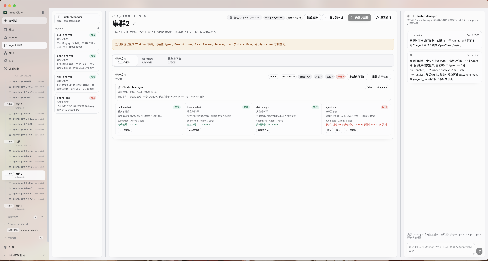
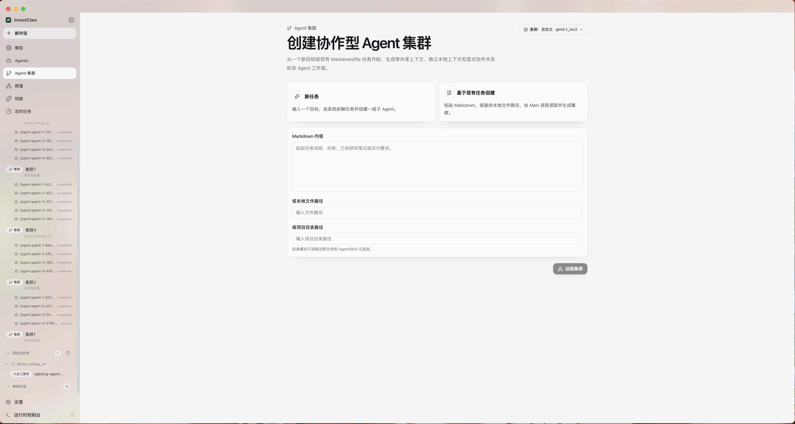
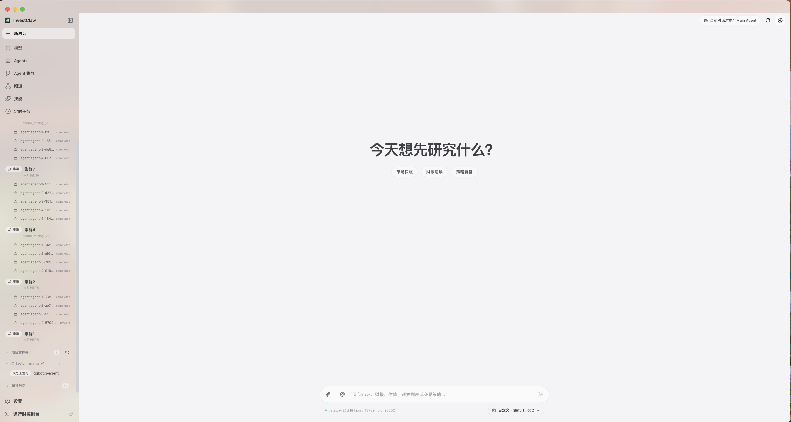
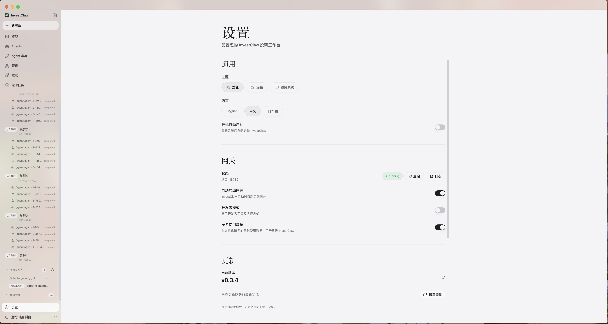
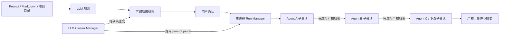

<p align="center">
  
</p>

<h1 align="center">InvestClaw</h1>

<p align="center">
  <strong>本地优先的多 Agent 投资研究桌面应用</strong>
</p>

<p align="center">
  <a href="#agent-集群">Agent 集群</a> •
  <a href="#功能特性">功能特性</a> •
  <a href="#为什么选择-investclaw">为什么选择 InvestClaw</a> •
  <a href="#快速上手">快速上手</a> •
  <a href="#系统架构">系统架构</a> •
  <a href="#开发指南">开发指南</a> •
  <a href="#参与贡献">参与贡献</a>
</p>

<p align="center">
  
  
  
  
  
</p>

<p align="center">
  <a href="README.md">English</a> | 简体中文
</p>

---

## 概述

**InvestClaw** 是一套面向投资场景的桌面研究工作台，让你不用命令行也能完成市场跟踪、财报阅读、观察列表维护和多步骤分析。

无论你是在做盘前快照、复盘个股财报，还是安排日常组合检查任务，InvestClaw 都能把这些流程收拢到同一个桌面界面里。

InvestClaw 内置运行时能力、多模型配置、文档处理技能和桌面级控制能力。当然，你也可以通过 **设置 → 高级 → 开发者模式** 做进一步的精细化配置。

本仓库是由 [EthanCai330](https://github.com/EthanCai330) 维护、以 Agent 集群为重点的社区增强版本，基于上游 [Arain-sh/InvestClaw](https://github.com/Arain-sh/InvestClaw) 开发，并保留 MIT 许可证和原有贡献历史。

> InvestClaw 仅用于研究辅助，不构成任何投资建议，实际决策请自行核验。

---

## 截图预览

<p align="center">
  <strong>Agent 集群工作台</strong><br>
  
</p>

<p align="center">
  <strong>从任务、Markdown、文件或项目目录创建</strong><br>
  
</p>

<p align="center">
  <strong>单独对话</strong><br>
  
</p>

<p align="center">
  <strong>设置</strong><br>
  
</p>

---

## 为什么选择 InvestClaw

投资研究不应该建立在一堆零散标签页和临时笔记之上。InvestClaw 的目标，是把 Agent 驱动的投研流程做成清晰、可重复、易追踪的桌面工作流。

| 痛点 | InvestClaw 解决方案 |
|------|----------------|
| 研究流程分散在多个工具 | 用一个桌面工作台统一聊天、文件、Agent 与定时任务 |
| 财报和文档阅读量太大 | 内置 PDF、表格、文档解析能力 |
| 每天重复做同样的检查 | 用定时任务自动跑盘前、盘后和组合巡检 |
| 模型与 Provider 切换麻烦 | 统一的模型与回退配置面板 |
| AI 工作流难以复盘 | 会话历史、显式 Agent 路由和运行状态一目了然 |

### 内置运行时

InvestClaw 将运行时直接打包进桌面应用本体中，让安装、升级和日常使用都收敛在同一套产品流程里。

这样可以让投研工作更顺手：更少的手动步骤、更少的环境分裂，以及更稳定一致的桌面体验。

---

## 功能特性

### 🎯 零配置门槛
从安装到第一次 AI 对话，全程通过直观的图形界面完成。无需终端命令，无需 YAML 文件，无需到处寻找环境变量。

### 💬 智能聊天界面
通过现代化的聊天体验与 AI 智能体交互。支持多会话上下文、消息历史记录、Markdown 富文本渲染，以及在多 Agent 场景下通过主输入框中的 `@agent` 直接路由到目标智能体。
当你使用 `@agent` 选择其他智能体时，InvestClaw 会直接切换到该智能体自己的对话上下文，而不是经过默认智能体转发。各 Agent 工作区默认彼此分离，但更强的运行时隔离仍取决于运行时自身的 sandbox 配置。
每个 Agent 还可以单独覆盖自己的 `provider/model` 运行时设置；未覆盖的 Agent 会继续继承全局默认模型。
侧边栏会把历史组织为 Agent 集群、项目文件夹和单独对话。单独对话可以拖入项目文件夹做本地 UI 归档，不移动底层 OpenClaw transcript 文件。

## Agent 集群

Agent 集群可以把一份研究需求或现有项目转换成可检查、可编辑、可恢复的多 Agent 工作流。Renderer 不直接访问 OpenClaw；创建、文件读取、持久化、调度和运行恢复都通过 Host API 进入 Electron main。

### 从已有上下文创建

- **新任务：** 输入研究目标，由当前选择的 AI Provider 建议 Agent、职责、共享上下文和流程。
- **Markdown 或文件：** 导入已有规格，不移动源文件。
- **项目目录：** 先读取 `README.md` 与 `HANDOFF.md`，再按可选的 `InvestClaw Directory Manifest` 加载声明的 Agent prompt、工具、技能和上下文。
- **权威 Agent prompt：** 项目声明了 Agent 定义文件时，InvestClaw 保留这些定义，规划模型主要负责共享上下文和编排建议，不重新发明角色。

目录 Manifest 示例：

```yaml
agent_prompts:
  - agents/data_steward.md
  - agents/factor_generator.md
agent_tools:
  - agents/tools/prepare_data.py
skills:
  - skills/research/SKILL.md
context:
  - core/domain_rules.md
```

Manifest 路径必须位于项目根目录内；绝对路径、`..` 越界和符号链接逃逸都会被拒绝。

### 先确认编排，再启动运行

规划模型只生成建议图，不会立即并行启动全部 Agent。用户可以在运行前移动节点、增删关系、修改边类型，并为子链设置循环次数。

| 关系类型 | 调度行为 |
|---------|---------|
| `blocks` | 上游真实完成且产物通过校验后，下游才启动 |
| `reviews` | 审查节点完成后，被审查路径才能继续 |
| `informs` | 只传递上下文，不阻塞运行 |
| `reports_to` | 表示汇报关系，不强制执行顺序 |
| `writes_to_memory` | 表示记忆交接，不形成 DAG 依赖 |

阻塞关系必须构成合法 DAG；需要重复执行时使用独立循环组件，不用阻塞环破坏调度。

### 真实子会话与可靠调度



- 每个业务 Agent 都运行在独立 OpenClaw 子会话中，拥有自己的本地上下文。
- 共享上下文只保存摘要、决策、约束和产物，不自动混入所有 Agent 私有消息。
- Run Manager 解析结构化完成信号并校验当前 Agent 产物，通过后才解除下游阻塞。
- Gateway 事件与 transcript 自动对账并更新图谱；同时提供刷新、重试、跳过、停止、重置和“从这里开始”。
- LLM Cluster Manager 会把自然语言改动转换为待确认提案；prompt patch、新 Agent 和图谱修改只有在用户应用提案后才生效。

### 集群工作台

详情页由三个可拖拽区域组成：Agent 状态、编排图和对话/事件流。侧边栏把历史分为 **Agent 集群**、**项目文件夹** 和 **单独对话**；普通对话可以拖入项目文件夹，但不会移动 OpenClaw transcript。

Agent 集群规划需要先在 **设置 → AI Providers** 中配置并启用 Provider。公开版本不会内置或默认访问任何私人模型地址。

## 更多功能

### 📡 多频道管理
同时配置和监控多个 AI 频道。每个频道独立运行，允许你为不同任务运行专门的智能体。
现在每个频道支持多个账号，并可在 Channels 页面直接完成账号绑定到 Agent 与默认账号切换。
InvestClaw 现在还内置了个人微信渠道桥接能力，可直接在 Channels 页面通过内置二维码流程完成微信连接。

### ⏰ 定时任务自动化
调度 AI 任务自动执行。定义触发器、设置时间间隔，让 AI 智能体 7×24 小时不间断工作。
现在定时任务页面已经可以直接配置外部投递，统一拆成“发送账号”和“接收目标”两个下拉选择。对于已支持的通道，接收目标会从通道目录能力或已知会话历史中自动发现，不需要再手动修改 `jobs.json`。
已知限制：微信当前不在支持的定时任务投递通道列表内。原因是 `openclaw-weixin` 插件的出站发送依赖实时会话里的 `contextToken`，插件本身不支持 cron 这类主动推送场景。

### 🧩 可扩展技能系统
通过预构建的技能扩展 AI 智能体的能力。在集成的技能面板中浏览、安装和管理技能——无需包管理器。
InvestClaw 还会内置预装完整的文档处理技能（`pdf`、`xlsx`、`docx`、`pptx`），在启动时自动部署到托管技能目录（默认 `~/.openclaw/skills`），并在首次安装时默认启用。额外预装技能（`find-skills`、`self-improving-agent`、`tavily-search`、`brave-web-search`）也会默认启用；若缺少必需的 API Key，运行时会直接给出配置错误提示。  
Skills 页面可展示来自多个运行时来源的技能（托管目录、workspace、额外技能目录），并显示每个技能的实际路径，便于直接打开真实安装位置。

重点搜索技能所需环境变量：
- `BRAVE_SEARCH_API_KEY`：用于 `brave-web-search`
- `TAVILY_API_KEY`：用于 `tavily-search`（上游运行时也可能支持 OAuth）

### 🔐 安全的供应商集成
连接多个 AI 供应商（OpenAI、Anthropic 等），凭证安全存储在系统原生密钥链中。OpenAI 同时支持 API Key 与浏览器 OAuth（Codex 订阅）登录。
如果你通过 **自定义（Custom）Provider** 对接 OpenAI-compatible 网关，可以在 **设置 → AI Providers → 编辑 Provider** 中配置自定义 `User-Agent`，以提高兼容性。

### 🌙 自适应主题
支持浅色模式、深色模式或跟随系统主题。InvestClaw 自动适应你的偏好设置。

### 🚀 开机启动控制
在 **设置 → 通用** 中，你可以开启 **开机自动启动**，让 InvestClaw 在系统登录后自动启动。

---

## 快速上手

### 系统要求

- **操作系统**：macOS 11+、Windows 10+ 或 Linux（Ubuntu 20.04+）
- **内存**：最低 4GB RAM（推荐 8GB）
- **存储空间**：1GB 可用磁盘空间

### 安装方式

#### 预构建版本（推荐）

从 [Releases](https://github.com/EthanCai330/Agent_TEAM_investclaw/releases) 页面下载适用于你平台的最新版本。

#### 从源码构建

```bash
# 克隆仓库
git clone https://github.com/EthanCai330/Agent_TEAM_investclaw.git
cd InvestClaw

# 初始化项目
pnpm run init

# 以开发模式启动
pnpm dev
```
### 首次启动

首次启动 InvestClaw 时，**设置向导** 将引导你完成以下步骤：

1. **语言与区域** – 配置你的首选语言和地区
2. **AI 供应商** – 通过 API 密钥或 OAuth（支持浏览器/设备登录的供应商）添加账号
3. **技能包** – 选择适用于常见场景的预配置技能
4. **验证** – 在进入主界面前测试你的配置

如果系统语言在支持列表中，向导会默认选中该语言；否则回退到英文。

> Moonshot（Kimi）说明：InvestClaw 默认保持开启 Kimi 的 web search。  
> 当配置 Moonshot 后，InvestClaw 也会将运行时配置中的 Kimi web search 同步到中国区端点（`https://api.moonshot.cn/v1`）。
>
> `Kimi Code` 现已作为独立内置 Provider 提供，默认使用 coding endpoint（`https://api.kimi.com/coding`）和 `anthropic-messages` 协议；`Moonshot (CN)` 仍继续使用普通中国区端点。

### 代理设置

InvestClaw 内置了代理设置，适用于需要通过本地代理客户端访问外网的场景，包括 Electron 本身、InvestClaw 网关，以及 Telegram 这类频道的联网请求。

打开 **设置 → 网关 → 代理**，配置以下内容：

- **代理服务器**：所有请求默认使用的代理
- **绕过规则**：需要直连的主机，使用分号、逗号或换行分隔
- 在 **开发者模式** 下，还可以单独覆盖：
  - **HTTP 代理**
  - **HTTPS 代理**
  - **ALL_PROXY / SOCKS**

本地代理的常见填写示例：

```text
代理服务器: http://127.0.0.1:7890
```
说明：

- 只填写 `host:port` 时，会按 HTTP 代理处理。
- 高级代理项留空时，会自动回退到“代理服务器”。
- 保存代理设置后，Electron 网络层会立即重新应用代理，并自动重启 Gateway。
- 如果启用了 Telegram，InvestClaw 还会把代理同步到运行时的 Telegram 频道配置中。
- 当 InvestClaw 代理处于关闭状态时，Gateway 的常规重启会保留已有的 Telegram 频道代理配置。
- 如果你要明确清空运行时中的 Telegram 代理，请在关闭代理后点一次“保存代理设置”。
- 在 **设置 → 高级 → 开发者** 中，可以直接运行 **运行时诊断**，执行 `openclaw doctor --json` 并在应用内查看诊断输出。
- 在 Windows 打包版本中，内置的 `openclaw` CLI/TUI 会通过随包分发的 `node.exe` 入口运行，以保证终端输入行为稳定。

---

## 系统架构

InvestClaw 采用 **双进程 + Host API 统一接入架构**。渲染进程只调用统一客户端抽象，协议选择与进程生命周期由 Electron 主进程统一管理：

```┌─────────────────────────────────────────────────────────────────┐
│                        InvestClaw 桌面应用                             │
│                                                                  │
│  ┌────────────────────────────────────────────────────────────┐  │
│  │              Electron 主进程                                 │  │
│  │  • 窗口与应用生命周期管理                                      │  │
│  │  • 网关进程监控                                               │  │
│  │  • Agent 集群持久化、DAG 调度与运行恢复                         │  │
│  │  • 系统集成（托盘、通知、密钥链）                                │  │
│  │  • 自动更新编排                                               │  │
│  └────────────────────────────────────────────────────────────┘  │
│                              │                                    │
│                              │ IPC（权威控制面）                    │
│                              ▼                                    │
│  ┌────────────────────────────────────────────────────────────┐  │
│  │              React 渲染进程                                   │  │
│  │  • 现代组件化 UI（React 19）                                   │  │
│  │  • Zustand 状态管理                                           │  │
│  │  • 可调整宽度的 Agent 集群图谱与事件工作台                       │  │
│  │  • 统一 host-api/api-client 调用                               │  │
│  │  • Markdown 富文本渲染                                        │  │
│  └────────────────────────────────────────────────────────────┘  │
└──────────────────────────────┬──────────────────────────────────┘
                               │
                               │ 主进程统一传输策略
                               │（WS 优先，HTTP 次之，IPC 回退）
                               ▼
┌─────────────────────────────────────────────────────────────────┐
│                  Host API 与主进程代理层                          │
│                                                                  │
│  • hostapi:fetch（主进程代理，规避开发/生产 CORS）                │
│  • gateway:httpProxy（渲染进程不直连 Gateway HTTP）               │
│  • Agent 集群 API、文件系统边界与 Gateway 事件桥                     │
│  • 统一错误映射与重试/退避策略                                     │
└──────────────────────────────┬──────────────────────────────────┘
                               │
                               │ WS / HTTP / IPC 回退
                               ▼
┌─────────────────────────────────────────────────────────────────┐
│                     InvestClaw 网关                               │
│                                                                  │
│  • AI 智能体运行时与编排                                          │
│  • 消息频道管理                                                   │
│  • 技能/插件执行环境                                              │
│  • 供应商抽象层                                                   │
└─────────────────────────────────────────────────────────────────┘
```
### 设计原则

- **进程隔离**：AI 运行时在独立进程中运行，确保即使在高负载计算期间 UI 也能保持响应
- **前端调用单一入口**：渲染层统一走 host-api/api-client，不感知底层协议细节
- **主进程掌控传输策略**：WS/HTTP 选择与 IPC 回退在主进程集中处理，提升稳定性
- **优雅恢复**：内置重连、超时、退避逻辑，自动处理瞬时故障
- **安全存储**：API 密钥和敏感数据利用操作系统原生的安全存储机制
- **CORS 安全**：本地 HTTP 请求由主进程代理，避免渲染进程跨域问题

### 进程模型与 Gateway 排障

- InvestClaw 基于 Electron，**单个应用实例出现多个系统进程是正常现象**（main/renderer/zygote/utility）。
- 单实例保护同时使用 Electron 自带锁与本地进程文件锁回退机制，可在桌面会话总线异常时避免重复启动。
- 滚动升级期间若新旧版本混跑，单实例保护仍可能出现不对称行为。为保证稳定性，建议桌面客户端尽量统一升级到同一版本。
- 但 InvestClaw 网关监听应始终保持**单实例**：`127.0.0.1:18789` 只能有一个监听者。
- 可用以下命令确认监听进程：
  - macOS/Linux：`lsof -nP -iTCP:18789 -sTCP:LISTEN`
  - Windows（PowerShell）：`Get-NetTCPConnection -LocalPort 18789 -State Listen`
- 点击窗口关闭按钮（`X`）默认只是最小化到托盘，并不会完全退出应用。请在托盘菜单中选择 **Quit InvestClaw** 执行完整退出。

---

## 使用场景

### 🤖 个人 AI 助手
配置一个通用 AI 智能体，可以回答问题、撰写邮件、总结文档并协助处理日常任务——全部通过简洁的桌面界面完成。

### 📊 自动化监控
设置定时智能体来监控新闻动态、追踪价格变动或监听特定事件。结果将推送到你偏好的通知渠道。

### 💻 开发者效率工具
将 AI 融入你的开发工作流。使用智能体进行代码审查、生成文档或自动化重复性编码任务。

### 🔄 工作流自动化
将多个技能串联起来，创建复杂的自动化流水线。处理数据、转换内容、触发操作——全部通过可视化方式编排。

---

## 开发指南

### 前置要求

- **Node.js**：22+（推荐 LTS 版本）
- **包管理器**：pnpm 9+（推荐）或 npm

### 项目结构

```InvestClaw/
├── electron/                 # Electron 主进程
│   ├── api/                 # 主进程 API 路由与处理器
│   │   └── routes/          # RPC/HTTP 代理路由模块
│   ├── services/            # Provider、Secrets 与运行时服务
│   │   ├── providers/       # Provider/account 模型同步逻辑
│   │   └── secrets/         # 系统钥匙串与密钥存储
│   ├── shared/              # 共享 Provider schema/常量
│   │   └── providers/
│   ├── main/                # 应用入口、窗口、IPC 注册
│   ├── gateway/             # 网关进程管理
│   ├── preload/             # 安全 IPC 桥接
│   └── utils/               # 工具模块（存储、认证、路径）
├── src/                      # React 渲染进程
│   ├── lib/                 # 前端统一 API 与错误模型
│   ├── stores/              # Zustand 状态仓库（settings/chat/gateway）
│   ├── components/          # 可复用 UI 组件
│   ├── pages/               # Setup/Dashboard/Chat/Channels/Skills/Cron/Settings
│   ├── i18n/                # 国际化资源
│   └── types/               # TypeScript 类型定义
├── tests/
│   └── unit/                # Vitest 单元/集成型测试
├── resources/                # 静态资源（图标、图片）
└── scripts/                  # 构建与工具脚本
```
### 常用命令

```bash
# 开发
pnpm run init             # 安装依赖并下载 uv
pnpm dev                  # 以热重载模式启动（若缺失会自动准备预装技能包）

# 代码质量
pnpm lint                 # 运行 ESLint 检查
pnpm typecheck            # TypeScript 类型检查

# 测试
pnpm test                 # 运行单元测试
pnpm run comms:replay     # 计算通信回放指标
pnpm run comms:baseline   # 刷新通信基线快照
pnpm run comms:compare    # 将回放指标与基线阈值对比

# 构建与打包
pnpm run build:vite       # 仅构建前端
pnpm build                # 完整生产构建（含打包资源）
pnpm package              # 为当前平台打包（包含预装技能资源）
pnpm package:mac          # 为 macOS 打包
pnpm package:win          # 为 Windows 打包
pnpm package:linux        # 为 Linux 打包
```

### 通信回归检查

当 PR 涉及通信链路（Gateway 事件、Chat 收发流程、Channel 投递、传输回退）时，建议执行：

```bash
pnpm run comms:replay
pnpm run comms:compare
```

CI 中的 `comms-regression` 会校验必选场景与阈值。
### 技术栈

| 层级 | 技术 |
|------|------|
| 运行时 | Electron 40+ |
| UI 框架 | React 19 + TypeScript |
| 样式 | Tailwind CSS + shadcn/ui |
| 状态管理 | Zustand |
| 构建工具 | Vite + electron-builder |
| 测试 | Vitest + Playwright |
| 动画 | Framer Motion |
| 图标 | Lucide React |

---

## 参与贡献

我们欢迎各种贡献！无论是修复 Bug、开发新功能、改进文档还是翻译，每一份贡献都让 InvestClaw 变得更好。

### 如何贡献

1. **Fork** 本仓库
2. **创建** 功能分支（`git checkout -b feature/amazing-feature`）
3. **提交** 清晰描述的变更
4. **推送** 到你的分支
5. **创建** Pull Request

### 贡献规范

- 遵循现有代码风格（ESLint + Prettier）
- 为新功能编写测试
- 按需更新文档
- 保持提交原子化且描述清晰

---

## 许可证

InvestClaw 基于 [MIT 许可证](LICENSE) 发布。你可以自由地使用、修改和分发本软件。

---

<p align="center">
  <sub>Agent 集群增强版由 EthanCai330 维护 · 基于 Arain-sh/InvestClaw</sub>
</p>
